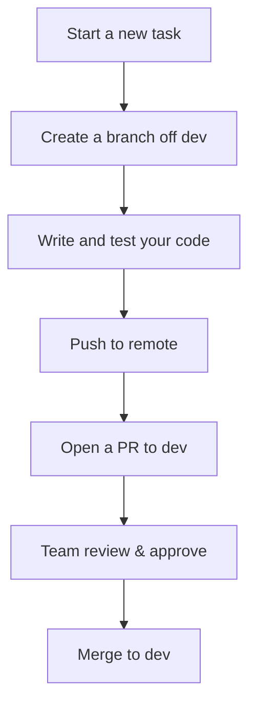

# 👥 Contributing to Booka

Welcome! We're glad you're interested in contributing to **Booka** — a platform helping students easily access textbooks across Nigerian universities.

This guide outlines the contribution process, code standards, and branch naming conventions to help maintain code quality and ensure smooth collaboration within our small but mighty team.

---

## 🔧 Getting Started

1. **Clone the Repository**  
   ```bash
   git clone https://github.com/booka-org/booka.git
   cd booka
````

2. **Choose a Folder**

   * `frontend/` → Next.js app
   * `backend/` → Node.js/Express API

---

## 🔀 Branching Strategy

We follow a **feature-based branching model**, where every task or fix lives in its own branch.

### 🎯 Naming Convention

| Task Type   | Branch Prefix | Example                      |
| ----------- | ------------- | ---------------------------- |
| New Feature | `feature/`    | `feature/user-auth`          |
| Bug Fix     | `fix/`        | `fix/delivery-status-update` |
| Chore/Other | `chore/`      | `chore/update-readme`        |

> **Always branch off `dev`**, **not `main`**.

```bash
git checkout dev
git pull origin dev
git checkout -b feature/user-auth
```

---

## 💬 Commit Message Guidelines

Write clear, concise commit messages using this structure:

```
<type>: <short description>

[optional body]
[optional footer]
```

### Types:

* `feat`: A new feature
* `fix`: A bug fix
* `chore`: Minor changes like formatting, comments, config
* `refactor`: Code changes that don't fix a bug or add a feature

### Examples:

```
feat: implement agent order dashboard

fix: resolve missing token error on student login
```

---

## 📦 Making a Pull Request

When your work is ready:

1. **Push your branch**

   ```bash
   git push origin feature/your-feature-name
   ```

2. **Open a Pull Request to `dev`**
   Make sure the PR:

   * Has a **clear title**
   * Uses the PR template
   * References the related issue number (if available)

### ✅ Pull Request Template

```
## Description
Short summary of the changes.

## Related Issue
Fixes #123

## Type of Change
- [ ] Bug fix
- [ ] New feature
- [ ] Chore
- [ ] Refactor

## Checklist
- [ ] Code compiles and passes tests
- [ ] Linter passes
- [ ] Feature works as expected
- [ ] UI has been tested (if applicable)

## Screenshots (if applicable)
```

---

## 🧪 Before You Push

* Ensure your code **runs locally** without errors
* Ensure all `.env.example` files remain updated if new env variables are added
* Run linting and formatting:

  ```bash
  # Frontend
  cd frontend && npm run lint

  # Backend
  cd backend && npm run lint
  ```

---

## 🤝 Collaboration Guidelines

* **Avoid pushing directly to `main` or `dev`**
* One task = one PR
* Small PRs > Huge PRs
* Review others' PRs when available
* Ask questions on issues/discussions when blocked

---

## 🔁 Fixing Issues or Bugs

If you're fixing a bug from the issue board:

1. Assign the issue to yourself (or notify the team).
2. Create a branch:

   ```bash
   git checkout -b fix/login-error
   ```
3. Reference the issue in your commit and PR:

   ```bash
   fix: resolve #42 - token not included in headers
   ```

---

## 🧼 Housekeeping Tips

* Keep commits atomic (small, focused changes)
* Update README or comments if your feature changes usage
* Use draft PRs for early feedback

---

## 🧵 Project Flow Summary



---

## 🙏 Thank You

We appreciate your contributions and time. Let's build something powerful for Nigerian students — together!

For questions, contact the team  or GitHub Issues/discussions.
